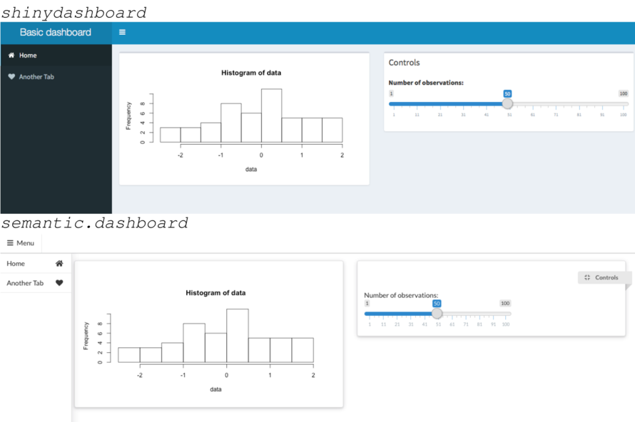
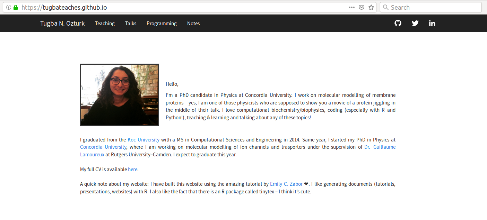

```{r setup, include=FALSE}
options(htmltools.dir.version = FALSE)
```

<!-- slide 1 --> 
# I am ...

--

- a statistical biophysicist.

- a workshop facilitator working for CTL and GradProSkills.

- an R enthusiast!


---
<!-- slide 2 --> 

# What is R?

```{r out.width = "25%", echo=FALSE, eval=TRUE, fig.align='center'}
knitr::include_graphics("images/r.png")
```

--


```{r, echo=FALSE, eval=TRUE}

```


---
<!-- slide 3 --> 

# What is R?

- robust and open source

- high level, easy-to-learn, simple syntax

- extendible (a lot of R packages)

- a vibrant community `r emo::ji("heart")`

- data analysis, data visualization, statistical analysis, machine learning, ...


---
<!-- slide 4 --> 

# Why learn R?

--

For data analysis:


```{r echo = FALSE, message=FALSE}
library(dplyr)
library(ggplot2)
library(nycflights13)
df <- flights %>% select(year:dep_time,arr_time,origin:air_time)
```


```{r echo = FALSE}
head(df)
```


--

```{r}
df %>% filter(origin == "JFK", (dest == "FLL" | dest == "ORD"), month == 12) %>%
    group_by(dest) %>% summarize(mean=mean(air_time, na.rm=TRUE))
```


---
<!-- slide 5 --> 

# Why learn R?

For data visualization:

--

.center[
```{r, echo=FALSE, fig.height=5,message=FALSE,warning=FALSE}
a <- df %>% filter(origin == "JFK", (dest == "FLL" | dest == "ORD"), month == 12) %>% group_by(dest) 
ggplot(data=a, aes(a$air_time)) + 
  geom_density( col="black", 
                 fill="green", 
                 alpha = .1) + labs(x="Time in the air (in minutes)", y="Count") + theme_bw() +
  theme(axis.line = element_line(colour = "black"),
    panel.grid.major = element_blank(),
    panel.grid.minor = element_blank(),
    panel.border = element_blank(),
    panel.background = element_blank()) + facet_wrap(vars(a$dest)) +theme(strip.background = element_blank(), strip.placement = "outside")
```
]


---
background-image: url(images/gganimate.png)
background-size: 300px
background-position: 90% 10%

<!-- slide 6 --> 
# Why learn R?


For data visualization:

.center[

```{r  out.width = "60%", echo=FALSE, warning=FALSE, message=FALSE}
library(ggplot2)
library(gganimate)
library(gapminder)

ggplot(gapminder, aes(gdpPercap, lifeExp, size = pop, colour = country)) +
  geom_point(alpha = 0.7, show.legend = FALSE) +
  scale_colour_manual(values = country_colors) +
  scale_size(range = c(2, 12)) +
  scale_x_log10() +
  facet_wrap(~continent) +
  # Here comes the gganimate specific bits
  labs(title = 'Year: {frame_time}', x = 'GDP per capita', y = 'Life Expectancy') +
  transition_time(year) +
  ease_aes('linear')


#if (knitr:::is_latex_output()) {
#  knitr::asis_output('\\url{....}')
#} else {
#  knitr::include_graphics("ggnaimateexample.gif") 
#}
```
]


---
<!-- slide 7 --> 

# Why learn R?

For making impressionist artwork:

.pull-left[
]

--

.pull-right[
]

.pull-left[.footnote[Image credit: [Romanin Francois's blog](http://romainfrancois.blog.free.fr/index.php?post/2010/11/12/What-would-impressionnists-do-with-R).]]


---
<!-- slide 8 --> 

# Why learn R?

For making dashboards, web applications:

```{r out.width = "70%", echo=FALSE, fig.align='center'}

```
.footnote[The image is taken from [here](https://appsilon.com/semantic-dashboard-new-open-source-r-shiny-package/).] 


---
<!-- slide 9 --> 

# Why learn R?

For increasing your academic visibility:

```{r, echo=FALSE, eval=TRUE}

```

---
<!-- slide 10 --> 

# Why learn R?

For text mining, geocomputation, statistical analysis, machine learning:

```{r, echo=FALSE, eval=TRUE, fig.align='center'}

```

`bookdown.org` has a lot of online books!


---
<!-- slide 12 --> 

# How to learn R?

--

- Local resources: 

    - GradProSkills R workshops (GPDI 515 and GPDI 517)
    - RLadies Montreal meet-ups! 
    
--

- Online resources:

    - Online courses (Coursera, EdX, DataCamp, Udemy, ...)
    - Tutorials (Youtube, RStudio, GitHub, ...)
    - Twitter (@hadleywickham, @jennybryan, @juliasilge, @dataandme, @RLadiesMTL, ...)
    - Blogs (r-tutor.com, r-bloggers.com, ...)


---
<!--slide 13-->

# R for Psychology

- [Learning Statistics with R](https://learningstatisticswithr.com/)

- Course notes for [Psychology Statistics](http://swirlstats.com/scn/Psychology_Statistics.html)

- [R-bloggers'](https://www.r-bloggers.com/learning-r-for-researchers-in-psychology/) suggestions for researchers in psychology (including lecture notes, mailing lists, online books and workshops)

- Popular websites:
    - `https://rpsychologist.com`
    - `https://personality-project.org/r`

---


class: inverse, center, middle

## Thank you!

## `r icon::fa("github")` tugbateaches/whyR 